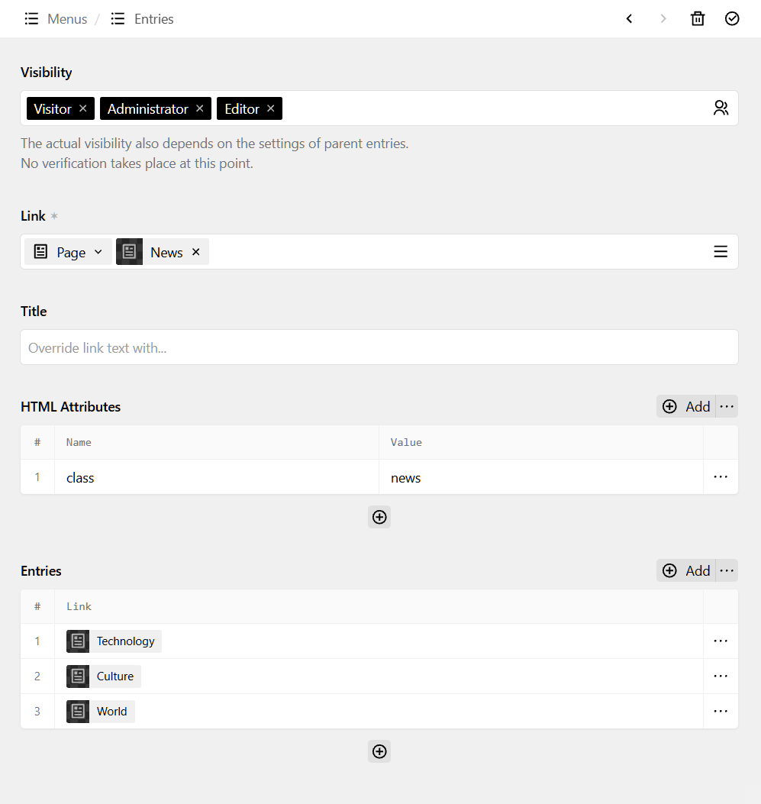

# Kirby Menu

This [Kirby CMS](https://www.getkirby.com)-Plugin lets you build and render structured menues with a variety of features.

## Features

* Custom deepness
* Custom HTML-Tags for root- & child-nodes
* Custom CSS-Classes for active- & descendant nodes
* Custom HTML-Attributes/Values for each node
* Custom user-roles for displaying each node
  * Custom default roles for new nodes
* Usable as a standalone field and a block
  - Block is extendable with own tabs
* All types of the "link"-field can be added as nodes
  - Disclaimer: active- & descendant nodes can only be detected for internal Kirby-Pages 

### Current translations

* English
* German

<a href="kirby-menu.png">
    
</a>

## Prerequisites

* Kirby 4.3+

## Installation

### Download

Download and copy this repository to `/site/plugins/kirby-menu`.

### Git submodule

```
git submodule add https://github.com/swiegmann/kirby-menu.git site/plugins/kirby-menu
```

### Composer

```
composer require swiegmann/kirby-menu
```

## Usage

### Field

1. Add the field to a site- or page-blueprint:
   
   ```yaml
   fields:
     yourfieldname:
       extends: fields/menu
   ```
   
   *Note: This is a structure-field. You can overwrite some reasonable properties like* `label` *or* `required`. *See [Structure Field Properties](https://getkirby.com/docs/reference/panel/fields/structure#field-properties) on the Kirby Site.*

2. The backend shows a structure-field where you added it.
   Add an entry. *[click (+) to add]*.
   Every entry is a full menu.
   Every menu needs a unique internal key, e.g.: "meta", which is later needed to render the menu in your snippet.
   Add some nodes and save.

3. The generic Kirby-Method to render the menu in your snippet is:
   
   ```php
   echo $site->menu($field, 'yourmenukey');
   ```
   
   ... where `$field` is of type `Kirby\Content\Field`.
   
   In my setup I have added the field `menues` to site.yml and created an entry with the internal key `meta`. This is how the part in my header-snippet looks like:
   
   ```php
   <?= $site->menu($site->content()->get('menues'), 'meta') ?>
   ```

### Block

1. Add the block to a layout/block-blueprint, e.g:
   
   ```yaml
   fields:
     yourfieldname:
       type: blocks
       fieldsets:
         - menu
   ```

2. Add a new block of 'menu' in your layout/block-field. *[click (+) to add]*
   Continue adding some nodes and save.

## HTML sample-result (exemplary)

```html
<ul>
  <li>
    <a href="https://domain.com">Home</a>
  </li>
  <li class="active-desc">
    <a href="https://domain.com/news">News</a>
    <ul>
      <li class="active">
        <a href="https://domain.com/news/technology" aria-current="page">Technology</a>
      </li>
      <li id="meta-culture">
        <a href="https://domain.comn/news/culture">Culture</a>
      </li>
      <li id="meta-world" class="important" data-something>
        <a href="https://domain.com/news/world">World</a>
      </li>
    </ul>
  <li>
</ul>
```

## Global Configuration

Configure global settings in your `config.php` file:

```php
return [
  'swiegmann.menu' => [
    'activeDescPageCssClass' => 'active-desc',
    'activePageCssClass' => 'active',
    'deepness' => '3',
    'defaultRoleKeys' => [],
    'listEntryTag' => 'li',
    'listTag' => 'ul',
    'visitorRoleKey' => 'visitor'
  ]
];
```

| Option                   | Default       | Type    | Description                                                                                                          |
| ------------------------ | ------------- | ------- | -------------------------------------------------------------------------------------------------------------------- |
| `activeDescPageCssClass` | `active-desc` | String  | CSS-Class for nodes of active child-nodes                                                                            |
| `activePageCssClass`     | `active`      | String  | CSS-Class for active nodes                                                                                           |
| `deepness`               | `3`           | Integer | maximum deepness                                                                                                     |
| `defaultRoleKeys`        | `[]`          | Array   | List of (user-) role-keys that get default view-privilegues, e.g. `['admin', editor', 'visitor']`. Empty = all roles |
| `listEntryTag`           | `li`          | String  | HTML-Tag for a node                                                                                                  |
| `listTag`                | `ul`          | String  | HTML-Tag for (level-) roots                                                                                          |
| `visitorRoleKey`         | `visitor`     | String  | Role-key of visitors. Can be either a Kirby role-key (if you created a visitor-role in your setup) or another string |

## Customize snippets

Copy the snippet-files from:

```
/site/plugins/kirby-menu/snippets
```

to:

```
/site/snippets
```

and apply your own logic.

## Add own tabs to the block

Copy the blueprint-file from:

```
/site/plugins/kirby-menu/blueprints/blocks/menu.yml
```

to:

```
/site/blueprints/blocks
```

and add your own tabs to the blueprint.

## License

[MIT License](https://github.com/swiegmann/kirby-menu/blob/main/LICENSE) Copyright © 2024-present swiegmann